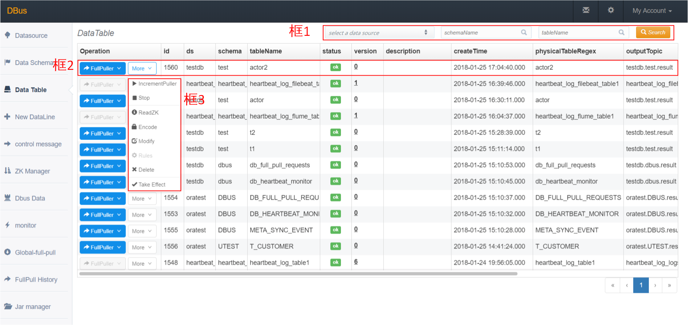
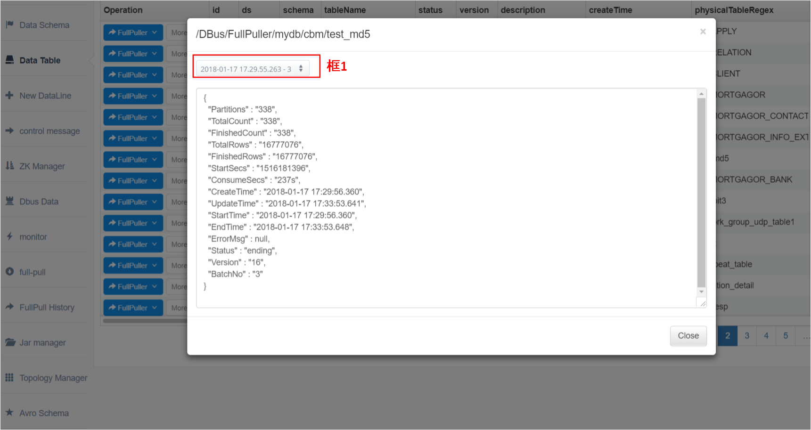
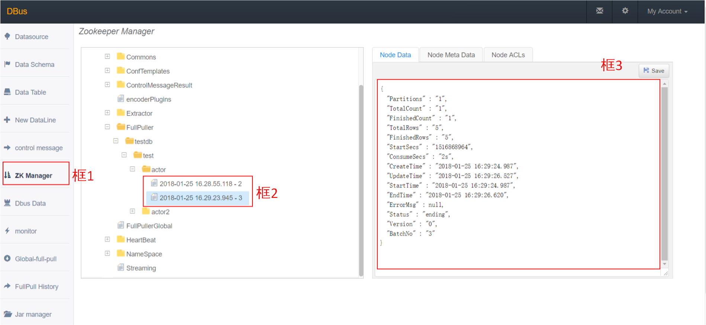
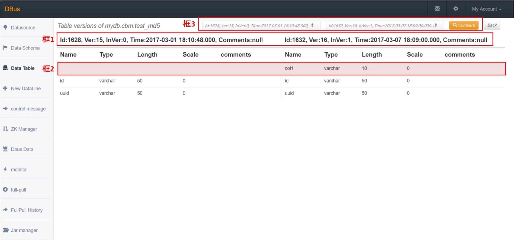
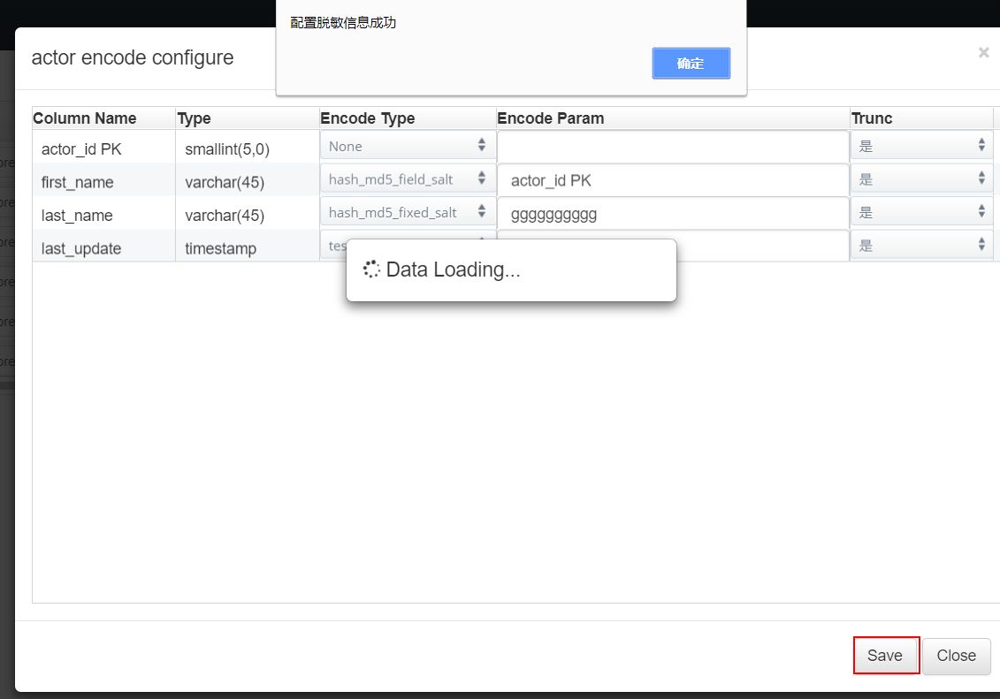
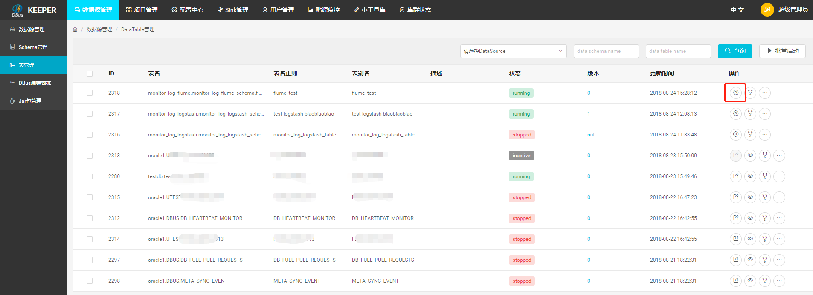
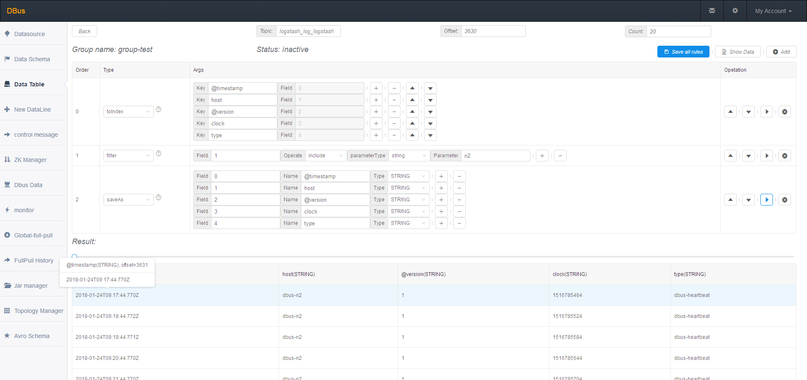

## 1 表基本信息

​	Data Table页面展示表的信息，如图所示。



### 1.1 查询表

​	如上图框1所示，可任意输入查询信息进行表的查询。

### 1.2 表信息

​	如上图框2所示是一张表的具体信息，FullPuller按钮可对表拉全量，more的下拉列表共七个按钮，分别为：

1. IncrementPuller，对表进行拉增量操作；

2. stop，停掉该表；

3. ReadZK，读取该表拉全量状态的zk节点；

4. Encode，对表进行脱敏配置；

5. Modify，编辑表的信息，编辑页面如下图；

   

   ​	其中，PTRegex为此表对应的物理表；description可添加对此表的描述信息；Before update可设置此表的update的触发方式。

6. Rules，对表进行日志规则配置；

7. Delete，删除该表。

​       此外，后面的列则列出表的其他信息，包括id,数据源ds，表状态status，表版本version等。其中，状态栏status有四种取值，绿色ok表示表正常，黄色ok表示表有表结构变更未查看，点击查看后可变为绿色，abort表示拉全量失败，waiting表示表正在拉全量；版本栏version可点击查看表的具体版本信息。

## 2 拉全量

​	我们提供两种拉全量方式：

### 2.1 与增量交互的全量拉取

点击表的FullPuller按钮可对表进行拉全量操作，此种拉全量与增量交互，如下图：


​	点击拉全量按钮后，会向增量程序发送一个全量请求消息，增量程序接收到此消息后，**会暂时停止增量数据运行，等待全量操作完成，全量操作完成后，会通知增量程序继续开始运行**。若全量拉取过程中出现异常，也会通知增量程序继续运行，同时会将错误消息写入zookeeper。

**优点**：

*全量和增量在 一个topic，先消费完全量数据才能消费增量数据，保证一定顺序性；*

*适合初始化加载；*

**缺点**：

*全量拉取进行时增量暂停，强迫其他消费方消费 不需要的额数据*

### 2.2 独立的全量拉取

​	Custom FullPuller按钮则执行独立全量拉取，如下图框1所示，输出到独立topic中，默认输出到independent.dsName.schemaName.result.time格式的topic，如下图框2所示：


​	

此种拉全量**增量不会暂停，增量和全量程序独立工作**。


### 2.3 查看拉全量状态

​	发送全量拉取请求后，可以在zk上查看拉取进度信息，有两种方式可以查看拉取进度：

1. 点击表的ReadZK按钮查看

   ​	如上所述，点击表的more下拉列表的ReadZK可读取该表的拉全量状态，点击框1的下拉列表可选择一个版本查看拉全量状态，保留三个历史版本的拉全量状态。拉全量状态页面如下图：

   

2. 在ZK Manager中查看

   ​	在ZK Manager的DBus/FullPuller/dsNmae/schemaName/tableName路径下，选择一个版本查看拉全量状态，如下如：

   

   ​拉全量状态信息如下：

```
Partitions: 分片数
TotalCount : 总分片数
FinishedCount : 当前完成分片数
TotalRows : 数据总行数
FinishedRows : 当前已拉取行数
StartSecs : 拉取开始时间
ConsumeSecs: 拉取数据已耗时多少
CreateTime : 拉取请求开始时间
UpdateTime : 更新时间
StartTime : 拉取开始时间
EndTime: 拉取结束时间
ErrorMsg : 拉取过程中产生的错误信息
Status :splitting表示正在分片，pulling表示正在拉取，ending表示拉取成功
Version : 版本号
BatchNo : 批次号，每拉取一次，批次号加1
```

## 3 页面具体功能说明

### 3.1 版本说明

​	Table versions页面展示表的版本信息，如图所示，如上所述由Data Table页面点击版本栏version进入。



​	默认显示出次新版本与最新版本的对比，对比信息包括：

**表信息（如框1所示）：**

```
Id：表id
Ver：表版本号
InVer:内部版本号
Time:此版本的时间
Comments:表注释
```

**表的所有列信息（如框2所示）：**

```
Name：字段名
Type：字段类型
Length：字段长度
Scale：列Scale
comments：列注释
#其中新增的列用不同颜色标出,如框2所示。
```

​	此外，如图中框3所示，可对指定版本进行对比，保留三个历史版本。

### 3.2 脱敏配置 生效

​	如上所述，点击表的more下拉列表的encoder可对该表进行脱敏配置，脱敏页面如下图。


​	我们提供以下几种脱敏类型，Encode Type脱敏类型说明及Encode Param脱敏参数配置如下：

1. None

   表示不进行脱敏

2. default

   默认脱敏类型，将数值型数据变为0，无需配置参数

3. replace

   此种脱敏类型将数据变为Encode Param中指定的参数

4. hash_md5

   用MD5进行脱敏，无需配置参数

5. hash_murmur

   用murmur进行脱敏，无需配置参数

6. hash_md5_field_salt

   用加盐的MD5进行脱敏，Encode Param中指定字符串作为盐值

7. hash_md5_fixed_salt

   用加盐的MD5进行脱敏，Encode Param中指定表的某一字段，用该字段的相应内容作为盐值


​        在ZK的DBus/Commons/encodrPlugins文件下，可查看所有脱敏类型。配置完成后，点击save按钮，显示配置脱敏信息成功即可对表进行脱敏。或者点击more的下拉列表的生效按钮则可生效脱敏配置。

#### 例子：

对表testdb/test/actor进行如下脱敏配置：



点击save按钮即可配置脱敏，或者在more的下拉列表点击生效按钮。

插入一条数据：

| actor_id | first_name | last_name | last_update         |
| -------- | ---------- | --------- | ------------------- |
| 982      | first_cui1 | last_cui2 | 2018-01-25 20:04:32 |

得到增量类型的UMS的payload如下：

```
"payload": [{
		"tuple": ["110000986886300", "2018-01-25 20:04:32.000", "i", "2241005", 982, "bb2a79aba0ee82075958002b06136677", "f3256641e959a92151c8100d8d8bacde", "123"]
	}],
```

## 4 日志规则配置说明（适用于所有页面）

**DBus** 可以对日志类型的数据源中每个表配置多个规则组，每个规则组中又可以含有多条规则。
在管理库中，和规则相关的表共有4张：

- **t_plain_log_rule_group**：临时规则组配置表
- **t_plain_log_rules**：临时规则配置表
- **t_plain_log_rule_group_version**：线上使用的规则组表
- **t_plain_log_rules_version**：线上使用的规则表

对规则组和规则的所有配置过程都只会影响两张临时表。

### 4.1 规则组

在 **Data Table** 页面中，找到需要配置规则的表


在其 **Operation** 选项中点击 **Rules**，即可进入规则组配置页面。



在此页面，右上角共有三个按钮：

- **Update version**：对临时表中所有 Status 项为 active 的规则组和规则，进行 **Diff** 校验，检查 saveAs 规则是否一致。如果一致，则复制到线上使用的两张表中，同时对该条数据线 log_processor 发送 reload 消息，log_processor 会加载最新版本的规则配置对日志处理
- **Diff**：比较选中的规则组的 saveAs 规则
- **Add group**：创建新的规则组

表格中各项含义如下：

- **ID**：规则组在数据库中的主键 id
- **Name**：规则组的名字，点击后进入该规则组的规则配置页面
- **Status**：表示该规则组的状态，可以为 active 或 inactive
- **Operation**：包含三个操作，分别是重命名、克隆和删除
- **Schema**：展示该规则组的 saveAs 规则
- **Update Time**：更新时间

### 4.2 规则

在规则组页面点击规则名字后，会跳转到该规则组的规则配置页面。


在页面的顶端，**Topic** 表示日志数据源的 topic，**Offset** + **Count** = 当前topic最新的offset

中间部分是规则的配置：

- **Save all rules**：保存该组的所有规则
- **Show Data**：不运行规则，只展示从Kafka中的原始数据
- **Add**：在规则列表最后添加一条规则

在规则配置表格中，有四列信息：

- **Order**：规则的顺序号
- **Type**：规则的算子类型，目前共有14种，具体使用方法下面会详细介绍
- **Args**：算子的参数，不同的算子参数也不同，加号和减号按钮分别表示参数的添加与删除
- **Operation**：四个操作分别为上移、下移、从第一条规则运行到此条规则、删除

在最下方的 **Result** 是规则运行结果的展示，鼠标悬浮在单元格上时可以显示此条日志的 offset



### 4.3 算子说明

- **flattenUms**：只能用于 Ums 类型的数据源，提供了对 Ums 中 namespace 的过滤功能
 - Namespace 根据Ums的namespace筛选日志

- **keyFilter**：用于将 json 类型的数据做过滤操作
 - Key 为需要过滤的键
 - Operate 的值有两种，include 表示包含符合条件的日志，exclude 表示去除符合条件的日志
 - parameterType 表示过滤参数的类型，字符串或正则表达式
 - parameter 为过滤参数

- **toIndex**：将 json 格式的数据中 Key 映射为下标
 - 在选择该算子时，会自动根据 Result 表的结果自动生成 Key 到下标的映射参数，因此，可以先使用 **Show Data** 将数据展示，在添加该算子

- **filter**：和 **keyFiler** 十分相似，用于对扁平的数据做过滤操作
 - Field为需要过滤的列
 - Operate、parameterType、parameter三个参数和 **KeyFilter** 中的三个同名参数作用相同

- **trim**：去除左右两边多余的字符
 - Field 为需要过滤的列
 - Operate 的取值有四种，both、left、right 分别为从左右、从左、从右去除字符，all 为从整个字符串中去除字符
 - parameter 为要去除的字符集合

- **replace**：替换操作
 - Field 为需要替换的列
 - ruleType 指定替换的类型
 - before 和 after 为替换前和替换后的字符串或正则表达式

- **split**：分割操作，分割后会在当前下标位置形成新的列
 - Field 为需要分割的列
 - parameterType 表示 token 的类型，字符串或正则表达式
 - token 为分割的参数

- **subString**：求子串
 - Field 为需要求子串的列
 - startType 为开始位置的类型。如果是 string，则 start 参数的值为字符串，表示从左侧的第一个 start 参数开始取子串；如果是 index，则 start 参数为数值类型，表示起始位置的下标
 - endType 和 end 的含义可以类比 startType 和 start

- **concat**：将多个列连接为新的列
 - Field 表示要连接的列，可以指定多列
 - parameter 表示列与列之间填充的字符串

- **select**：选择列
 - Field 表示选择的列，可以指定多列、重复列

- **saveAs**：将下标列映射为 key，在选择该算子时，与 **toIndex** 类型，会自动根据 **Result** 表自动按生成映射
 - Field 表示要映射的列
 - Name 表示映射结果的名称
 - Type 表示映射结果的类型

- **prefixOrAppend**：添加前缀或后缀
 - Field 表示要添加的列
 - Operator 取值为 before 或 after，表示从前或从后添加
 - parameter 表示添加的内容

- **regexExtract**：正则表达式捕获提取，提取出的内容会分别形成新的列
 - Field 表示要提取的列
 - parameter 表示正则表达式


#### **例子**

可参考：[基于可视化配置的日志结构化转换实现](http://dbaplus.cn/news-134-1860-1.html)