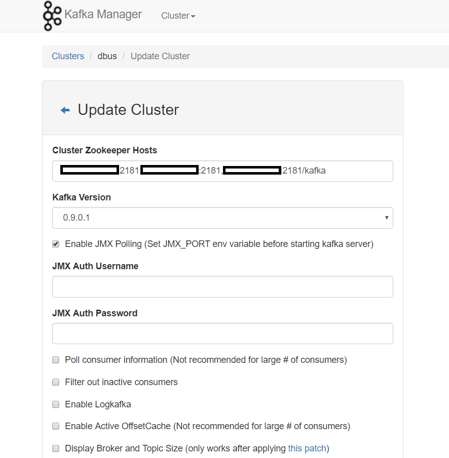
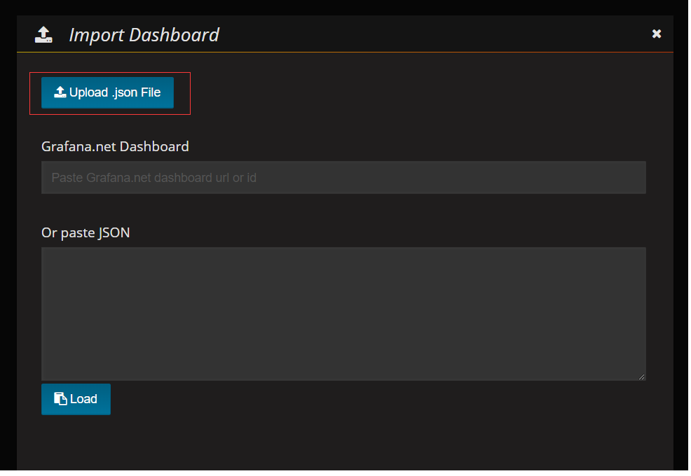

{:toc}

> DBUS依赖于Zookeeper、Kafka、Storm、InfluxDB、Grafana及Mysql等。这些通用组件的安装可到官网下载安装包，并遵循官方用户手册安装就可。也可到下面网盘地址下载：
>
> https://pan.baidu.com/s/1bRLz0n1FFmGWtOn-lvS5LA
>

# 1. 安装ZooKeeper

## 1.1 下载&安装

推荐下载zookeeper版本；zookeeper-3.4.8
地址：[http://zookeeper.apache.org/releases.html](http://zookeeper.apache.org/releases.html)

zookeeper安装在目录：/app/dbus/zookeeper-3.4.8

## 1.2 配置

### 1.2.1 通用配置如下：

分别配置dbus-n1、dbus-n2、dbus-n3的/app/dbus/zookeeper-3.4.8/conf/zoo.cfg文件

```
# zk日志数据存储路径
dataDir=/data/zookeeper-data/

# 设置zk节点间交互端口
server.1=dbus-n1:2888:3888
server.2=dbus-n2:2888:3888
server.3=dbus-n3:2888:3888

# 单个客户端最大连接数，0为不限制
maxClientCnxns=0

# 日志和快照文件保留3
autopurge.snapRetainCount=3

# 日志和快照文件清理周期为1小时
autopurge.purgeInterval=1
```

### 1.2.2 特殊配置：

分别在dbus-n1、dbus-n2、dbus-n3的/data/zookeeper-data/目录下执行如下命令：

```
# dbus-n1
echo "1" >> myid

# dbus-n2
echo "2" >> myid

# dbus-n3
echo "3" >> myid
```

## 1.3 启动
分别在dbus-n1、dbus-n2、dbus-n3的/app/dbus/zookeeper-3.4.8/bin目录下执行如下命令：
```
./zkServer.sh start
```


# 2. 安装Kafka

## 2.1 下载&安装

推荐下载kafka版本：kafka_2.11-0.10.0.0
地址：[http://kafka.apache.org/downloads](http://kafka.apache.org/downloads)

kafka安装在目录：/app/dbus/kafka_2.11-0.10.0.0

## 2.2 配置

分别修改dbus-n1、dbus-n2、dbus-n3的/app/dbus/kafka_2.11-0.10.0.0/config/server.properties配置如下（以dbus-n1为例）：

```
# broker id. 需唯一
broker.id=1

# 设置监听端口（以dbus-n1为例）
listeners=PLAINTEXT://dbus-n1:9092
port=9092
# 设置kafka日志地址
log.dirs=/data/kafka-data

# 最大刷新间隔
log.flush.interval.ms=1000
# 消息留存大小，10GB。可自行调整。
log.retention.bytes=10737418240

# DBUS要求每条消息最大10MB
replica.fetch.max.bytes=10485760
message.max.bytes=10485760
#设置zk地址
zookeeper.connect=dbus-n1:2181,dbus-n2:2181,dbus-n3:2181/kafka
#设置topic可删除
delete.topic.enable=true
```

## 2.3 启动

分别在dbus-n1、dbus-n2、dbus-n3的/app/dbus/kafka_2.11-0.10.0.0/bin目录下执行如下命令：

```
 export JMX_PORT=9999;
./kafka-server-start.sh -daemon ../config/server.properties
```


# 3. 安装Kafka-manager

## 3.1 下载&安装

推荐下载kafka-manager版本：kafka-manager-1.3.3.4

地址：[https://github.com/yahoo/kafka-manager/releases](https://github.com/yahoo/kafka-manager/releases)  这个地址下载后需要编译打包比较麻烦，

可以从地址: [https://pan.baidu.com/s/10S-65-7vIl2OVQNl52Ms_Q](https://pan.baidu.com/s/10S-65-7vIl2OVQNl52Ms_Q) 直接下载已经编译好的安装包

选择一台机器安装kafka-manager，如dbus-n2

kafka安装在目录：/app/dbus/kafka-manager-1.3.3.4

## 3.2 配置

dbus-n2的/app/dbus/kafka-manager-1.3.3.4/conf/application.conf的配置如下：

```
# 设置zk地址
kafka-manager.zkhosts="dbus-n1:2181,dbus-n2:2181,dbus-n3:2181"
# 设置kafka manager用户名、密码
basicAuthentication.enabled=true
basicAuthentication.username="admin"
basicAuthentication.password="admin"
basicAuthentication.realm="Kafka-Manager"

```

## 3.3 启动

在dbus-n2的/app/dbus/kafka-manager-1.3.3.4/bin目录下执行如下命令：

```
nohup ./kafka-manager -Dconfig.file=../conf/application.conf >/dev/null 2>&1 &
```

## 3.4 验证

打开浏览器输入：http://dbus-n2:9000，出现如下页面：

用户名：admin 

密码：admin




登陆后，如上图进行配置，配置Cluster Zookeeper Hosts为dbus-n1对应ip:2181,dbus-n2对应ip:2181,dbus-n3对应ip:2181/kafka，点击下面的save页面保存，即可使用Kafka manager。

# 4. 安装Storm

## 4.1 下载&安装

推荐下载storm版本：apache-storm-1.0.1
地址：[http://storm.apache.org/downloads.html](http://storm.apache.org/downloads.html)

storm安装在目录：/app/dbus/apache-storm-1.0.1

## 4.2 配置

分别修改dbus-n1、dbus-n2、dbus-n3的/app/dbus/apache-storm-1.0.1/conf/storm.yaml配置如下（以dbus-n1为例）：

```
########### These MUST be filled in for a storm configuration
storm.zookeeper.servers:
    - "dbus-n1"
    - "dbus-n2"
    - "dbus-n3"

# zookeeper port
storm.zookeeper.port: 2181
storm.zookeeper.root: '/storm'

# Nimbus HA
nimbus.seeds: ["dbus-n1", "dbus-n2"]
storm.local.dir: "/data/storm-data"
# 以dbus-n1为例
storm.local.hostname: "dbus-n1"

ui.port: 8080

supervisor.slots.ports:
    - 6708
    - 6709
    - 6710
    - 6711
    - 6712

#worker.childopts: "-Xms512m -Xmx2048m"
worker.childopts: "-Dworker=worker -Xms1024m -Xmx2048m -Xmn768m -XX:SurvivorRatio=4 -XX:+UseConcMarkSweepGC  -XX:CMSInitiatingOccupancyFraction=60  -XX:CMSFullGCsBeforeCompaction=2 -XX:+UseCMSCompactAtFullCollection -XX:+PrintGCDetails -XX:+PrintHeapAtGC -XX:+PrintGCApplicationStoppedTime -Xloggc:/home/app/gc.log"
```

## 4.3 启动

在dbus-n1的/app/dbus/apache-storm-1.0.1/bin目录下执行如下命令：

```
./storm nimbus &
./storm supervisor &
./storm ui &
```

在dbus-n2的/app/dbus/apache-storm-1.0.1/bin目录下执行如下命令：

```
./storm nimbus &
./storm supervisor &
```

在dbus-n3的/app/dbus/apache-storm-1.0.1/bin目录下执行如下命令：

```
./storm supervisor &
```

## 4.4 验证

在dbus-n1执行jps -l命令后看到如下信息：


在dbus-n2执行jps -l命令后看到如下信息：


在dbus-n3执行jps -l命令后看到如下信息：


# 5. 安装InfluxDB

## 5.1 下载&安装

推荐下载InfluxDB版本：influxdb-1.1.0.x86_64
地址：[https://portal.influxdata.com/downloads](https://portal.influxdata.com/downloads)

在dbus-n1上切换到root用户，在influxdb-1.1.0.x86_64.rpm的存放目录下执行如下命令：

```
rpm -ivh influxdb-1.1.0.x86_64.rpm
```

## 5.2 启动

在dbus-n1上执行如下命令：

```
service influxdb start
```

## 5.3 初始化配置

在dbus-n1上执行如下命令：

```
#登录influx
influx

#执行初始化脚本
create database dbus_stat_db
use dbus_stat_db
CREATE USER "dbus" WITH PASSWORD 'dbus!@#123'
ALTER RETENTION POLICY autogen ON dbus_stat_db DURATION 15d
```


# 6. 安装Grafana

## 6.1 下载&安装

推荐下载grafana版本：grafana-3.1.1
地址：[https://grafana.com/grafana/download](https://grafana.com/grafana/download)

在dbus-n1上首先切换到root用户，执行如下命令

```
rpm -ivh grafana-3.1.1-1470047149.x86_64.rpm
```

## 6.2 配置

在dbus-n1上修改配置文件/etc/grafana/grafana.ini的[security]部分如下，其它部分不用修改：

```
[security]
# default admin user, created on startup
admin_user = admin

# default admin password, can be changed before first start of grafana,  or in profile settings
admin_password = admin
```

## 6.3 启动

在dbus-n1上执行如下命令：

```
service grafana-server start
```

## 6.4 验证

### 6.4.1 登录grafana

打开浏览器输入：http://dbus-n1:3000/login，出现如下页面：

用户名：admin 

密码：admin


### 6.4.2 配置grafana

#### 6.4.2.1 配置Grafana influxdb数据源如下图：


密码：dbus!@#123 (安装influxdb初始化配置脚本设置的密码)

#### 6.4.2.2 配置Grafana Dashboard

下载Schema Dashboard配置：initScript/init-table-grafana-config/grafana-schema.cfg

下载Table Dashboard配置：initScript/init-table-grafana-config/grafana-table.cfg

下载log Dashboard 配置：init-scripts/init-log-grafana-config/*.cfg

操作步骤如下：




分别上传schema.json和table.json的配置文件


导入后出现如上图所示的两个dashboards。


# 7.安装Mysql dbusmgr库

安装好mysql数据库服务，创建dbusmgr库，创建用户dbusmgr, 密码Dbusmgr!@#123 ，并授权用户dbusmgr能访问dbusmgr库，参考下面脚本：

```
create database dbusmgr DEFAULT CHARSET utf8 COLLATE utf8_general_ci;
create user 'dbusmgr'@'%' identified by 'Dbusmgr!@#123';
flush privileges;
grant all privileges on dbusmgr.* to 'dbusmgr'@'%' identified by 'Dbusmgr!@#123';
flush privileges;
```

