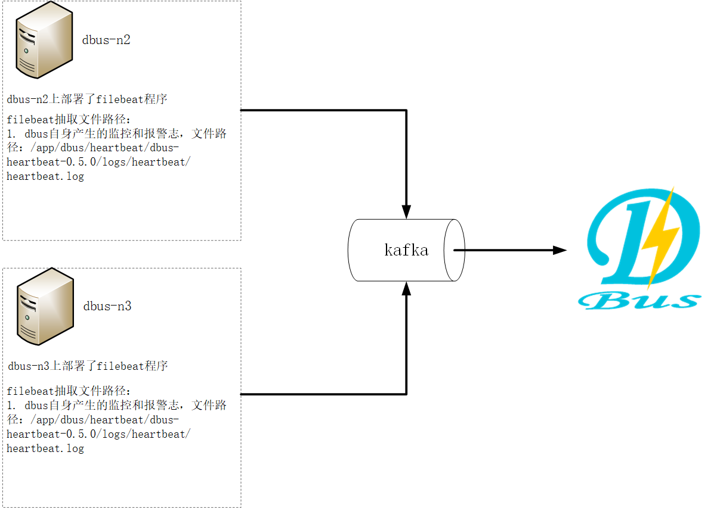
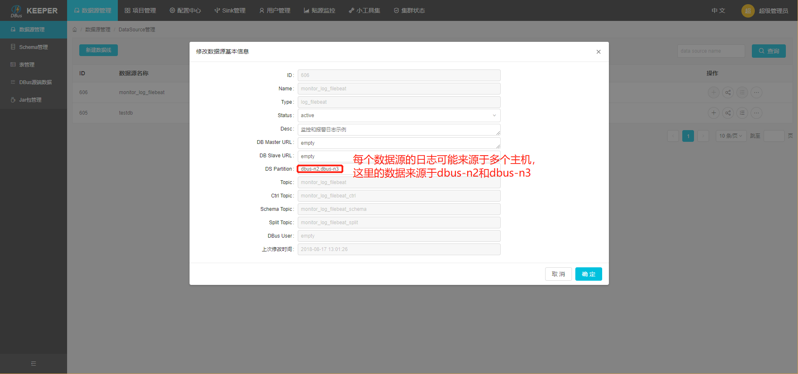
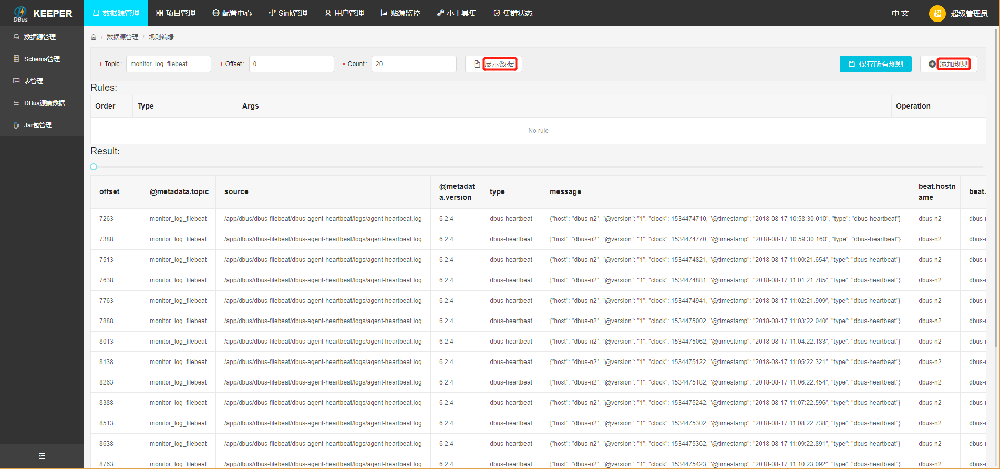
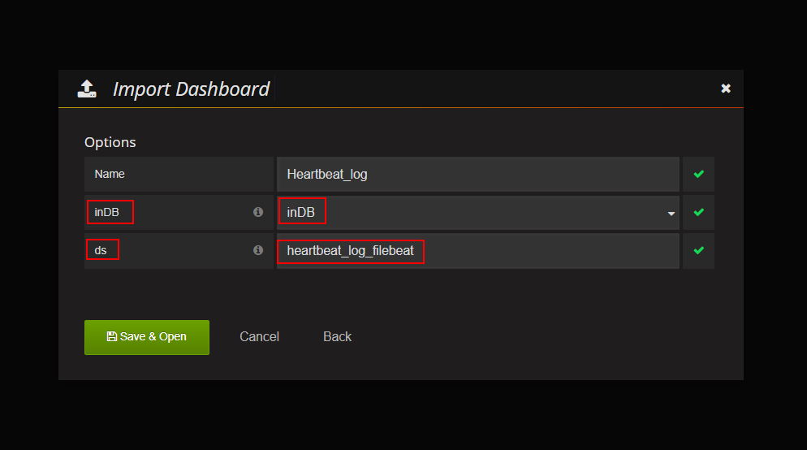
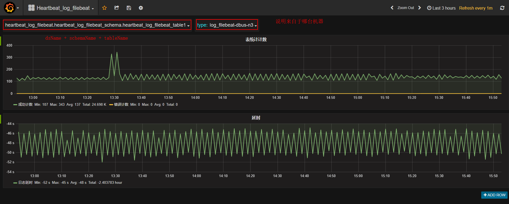

* This will become a table of contents (this text will be scraped).
 {:toc}
**系统架构：**



**总体说明：**

​	DBus可以接入三种数据源：logstash、flume、filebeat，下面以使用filebeat为数据抽取端，抽取DBus自身产生的监控和报警日志数据为例进行说明。

​	DBus监控和报警模块部署在 dbus-n2和dbus-n3 上，路径为：/app/dbus/heartbeat/dbus-heartbeat-0.5.0/logs/heartbeat/heartbeat.log。因此，filebeat的日志数据抽取端也要部署在dbus-n2和dbus-n3 上。

​	另外与logtash不同，filebeat需要一个额外的产生心跳数据的shell脚本，输出的日志在解压包的相对路径：./dbus-agent-heartbeat/logs/agent-heartbeat.log，用于监测整条链路是否正常工作。因此，产生心跳数据的shell脚本也要部署在dbus-n2和dbus-n3 上。

​	filebeat抽取程序同时监控DBus自身的监控和报警日志（路径：/app/dbus/heartbeat/dbus-heartbeat-0.5.0/logs/heartbeat/heartbeat.log） 和shell脚本产生的心跳数据（相对路径：./dbus-agent-heartbeat/logs/agent-heartbeat.log），这样，filebeat既可以抽取监控和报警日志，也可以抽取自身产生的心跳日志。

|  No  |   域名    | 是否有监控和报警日志？ | 是否部署filebeat？ | 是否部署心跳shell脚本？ |                   抽取日志                   |       输出topic        |
| :--: | :-----: | :---------: | :-----------: | :------------: | :--------------------------------------: | :------------------: |
|  1   | dbus-n1 |      否      |       否       |       否        |                    无                     |          无           |
|  2   | dbus-n2 |      是      |       是       |       是        | 1.DBus自身产生的监控和报警日志                                              2. shell脚本产生的心跳数据 | monitor_log_filebeat |
|  3   | dbus-n3 |      是      |       是       |       是        | 1.DBus自身产生的监控和报警日志                                              2. shell脚本产生的心跳数据 | monitor_log_filebeat |


**主要配置步骤：**

1 配置和安装filebeat源相关

2 一键加线和配置

3 检验结果

## 1  配置和安装filebeat源相关

监控和报警日志在dbus-n2和dbus-n3上，因此 filebeat的日志数据抽取端也要部署在dbus-n2和dbus-n3 上。

### 1.1 dbus-filebeat下载

* **filebeat版本**

  DBus使用的filebeat的版本是v6.2.4。

* **下载地址**

  包名称：dbus-filebeat.tar.gz

  网盘地址：https://pan.baidu.com/s/1b1aKueXLvO2GigB5fa4kNw

* **dbus-filebeat目录说明**

    **目录结构：**

    下载之后，直接在任意目录解压即可，解压目录如下图所示。dbus-filebeat包含检测和自动配置脚本、心跳脚本以及程序启停脚本。

    

     **filebeat目录 :**filebeat程序文件夹，用户可手动更改filebeat.yml，也可以使用dbus的检测和部署脚本（即checkDeploy.sh脚本）来自动替换配置项

     **checkDeploy.sh:** 用于自动替换filebeat配置文件所需要修改的配置项，在conf目录下进行修改，该脚本会自动将配置项替换到filebeat.yml中

     **time_heartbeat.sh :** 定时产生心跳，并将心跳日志写入dbus-agent-heartbeat文件夹中，filebeat会从中抽取心跳日志

     **dbus-agent-heartbeat :** 放置定时心跳脚本产生的心跳日志

     **start.sh :**  启动脚本，一键启动filebeat程序、心跳程序等

     **stop.sh :**   停止脚本，一键停止filebeat程序、心跳程序等


### 1.2 dbus-filebeat启动


1. 修改通用配置：
   修改conf目录下的log-conf.properties文件，对于filebeat，只需要修改kafka地址、日志类型及filebeat相关配置即可。

   

2. 自动检测部署：

   ```
   执行命令：./checkDeploy.sh 
   ```

   执行checkDeploy.sh脚本，可以自动检测kafka是否正常连接，若kafka连接正常，部署脚本将会把conf目录下的修改项替换到filebeat.yml文件中，用户可在控制台看到相关配置项是否替换成功，也可以查看reports目录下的检测和部署报告，确认通过后，进行后续步骤。

   控制台信息输出如下所示（检测及部署成功的信息）：

   

   控制台信息输出如下所示（检测及部署失败的信息）：

   

3. 启动方式：

   ```
   执行命令：./start.sh
   ```

   启动脚本，该脚本会启动filebeat程序及定时心跳程序。如果没有报错，则会提示filebeat和心跳程序启动成功。如果有错误，会提示相应错误信息及包含详细错误信息的startup.log文件，请根据错误信息进行修改。

   

4. 停止方式：

   ```
   执行命令：./stop.sh
   ```

   停止脚本，停止filebeat及定时心跳程序。

### 1.3 验证filebeat配置成功

**读取kafka的topic：monitor_log_filebeat，确认是否有数据：**

- **进入kafka安装目录。**
- **执行以下命令，查看数据，如果有数据，则说明filebeat可以成功抽取文件：**

`bin/kafka-console-consumer.sh --zookeeper dbus-n1:2181,dbus-n2:2181,dbus-n3:2181/kafka  --topic monitor_log_filebeat`  

- **filebeat的心跳数据样例：**

```json
{
	"@timestamp": "2018-08-17T03:00:21.768Z",
	"@metadata": {
		"beat": "filebeat",
		"type": "doc",
		"version": "6.2.4",
		"topic": "monitor_log_filebeat"
	},
	"source": "/app/dbus/dbus-filebeat/dbus-agent-heartbeat/logs/agent-heartbeat.log",
	"offset": 7513,
	"message": "{\"host\": \"dbus-n2\", \"@version\": \"1\", \"clock\": 1534474821, \"@timestamp\": \"2018-08-17 11:00:21.654\", \"type\": \"dbus-heartbeat\"}",
	"prospector": {
		"type": "log"
	},
	"type": "dat",
	"beat": {
		"name": "dbus-n2",
		"hostname": "dbus-n2",
		"version": "6.2.4"
	}
}
```

- **filebeat抽取之后产生的数据样例：**

```json
{
	"@timestamp": "2018-08-17T03:00:21.768Z",
	"@metadata": {
		"beat": "filebeat",
		"type": "doc",
		"version": "6.2.4",
		"topic": "monitor_log_filebeat"
	},
	"source": "/app/dbus/heartbeat/dbus-heartbeat-0.5.0/logs/heartbeat/heartbeat.log",
	"offset": 7513,
	"message": "monitor started!",
	"prospector": {
		"type": "log"
	},
	"type": "data-log",
	"beat": {
		"name": "dbus-n2",
		"hostname": "dbus-n2",
		"version": "6.2.4"
	}
}
```

## 2 DBus 一键加线和配置

### 2.1 DBus一键加线

filebeat将数据抽取到Kafka topic后，DBus程序就可以对该topic数据进行处理了，在DBus web进行数据源和table的配置工作。

* **新建数据源：**首先新建数据源，进入New DataLine页面，由于我们是用filebeat对心跳日志进行抽取，因此数据源的名字可以起的有意义一些，Type选择log_filebeat，topic必须和filebeat配置文件中的topic一致。

   

* **新增表：**点击Add Table按钮，新增一张表，稍后会对该表进行规则配置，新增完后，点击下一步。

   

* **启动log_processor程序：**启动storm程序，对数据进行处理，后面会对新增表进行规则配置。

   

     **启动结果：**点击启动按钮后，当Status变为running后，表示启动成功，如果启动不成功，可以通过log定位失败原因。
   


### 2.2 数据源配置修改

因为我们在dbus-n1和dbus-n2两台机器中分别配置了filebeat程序，用于对数据进行抽取，而DBus监控和报警模块会对来自这两台机器的数据流进行监控，因此，我们需要在数据源配置信息中，将多台主机的host信息填入dsPartition选项中，供dbus监控和报警模块使用，注意：如果主机的hostname是ip，请将"."转换为"_"，例如：127.0.0.1应该要转换为127_0_0_1。


* **修改数据源信息：**点击modify按钮进行修改。
   
* **填写host信息：**该数据源的数据可能来自于多个主机上的filebeat程序，要在dsPartition中，配置上所有主机的host信息，为DBus监控和报警模块使用。
   

### 2.3. 配置规则
* **进入Data Table页面，查看新增加的表，点击Rules按钮，为该表配置规则，详细配置方式请参考：([config-table.md](https://github.com/BriData/DBus/tree/master/docs/config-table.md)**

   

* **新增规则组：**点击Add group按钮，新增一个规则组，点击规则组名字，进入规则配置页面。

   

* **配置规则:** topic是在filebeat中配置的topic，即源topic，可以指定offset，获取固定区间的数据，然后点击show data按钮，此时会在页面下方显示原始数据，点击Add，新增一些过滤规则，对数据进行处理。配置完规则后，查看过滤出的数据，点击"保存规则"按钮，保存规则，并返回到规则组页面。

   

* **升级版本:** 首先使规则组的Status状态变为active，然后点击升级版本（每次增加、删除或修改规则组后，都应该对该表升一次版本）。

   

* **拉取增量:**  使该表的状态变为ok后，点击active按钮，使该表生效（当后续再对该表进行规则组配置操作后，也应该对该表再执行active生效按钮，使该表能够获取到最新的规则配置）。

   


## 3  验证数据

我们可以在grafana配置一下，看看实际流量情况。

* 上传grafana配置文件，[参考链接](https://github.com/BriData/DBus/tree/master/init-scripts/init-log-grafana-config) ： 点击Import，上传grafana json配置文件。
   
* **选择InDB数据库：**ds的名字必须与新建数据线中的数据源名字一致。
   

* **监控信息：**之前新增表的流量监控信息，type表示来自于哪台主机的数据。
   
* **\_unknown_table_表示不满足任何表的数据。**
   

