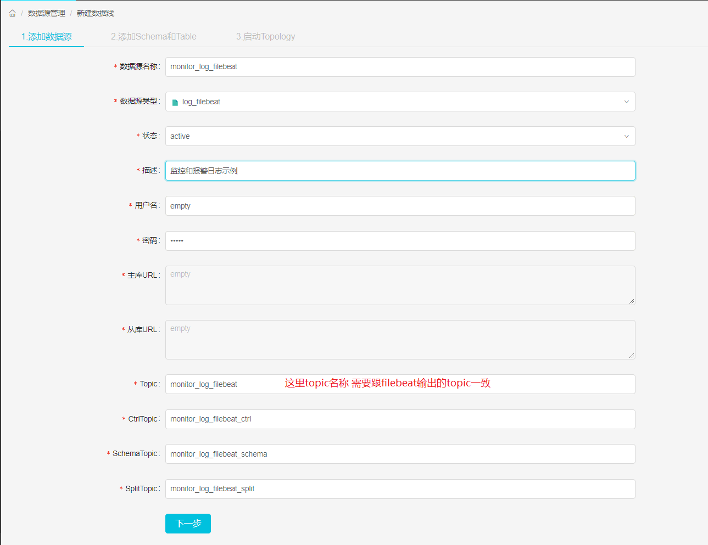
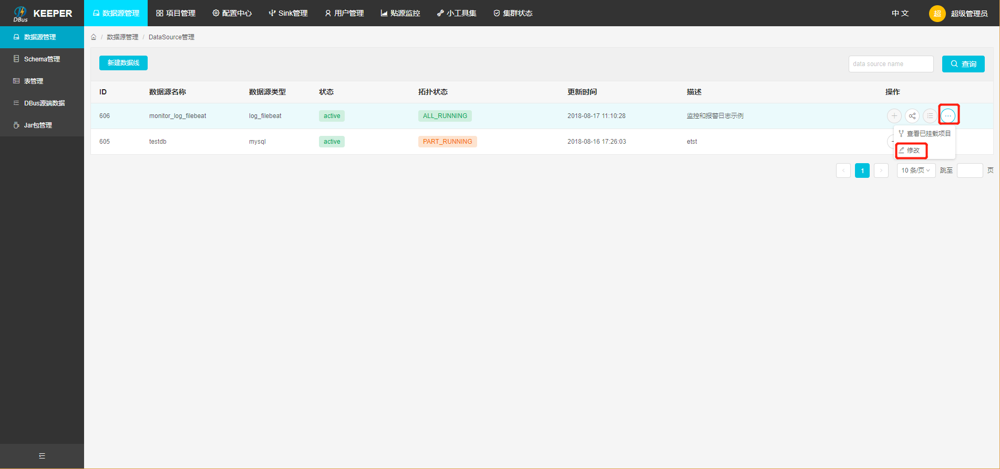
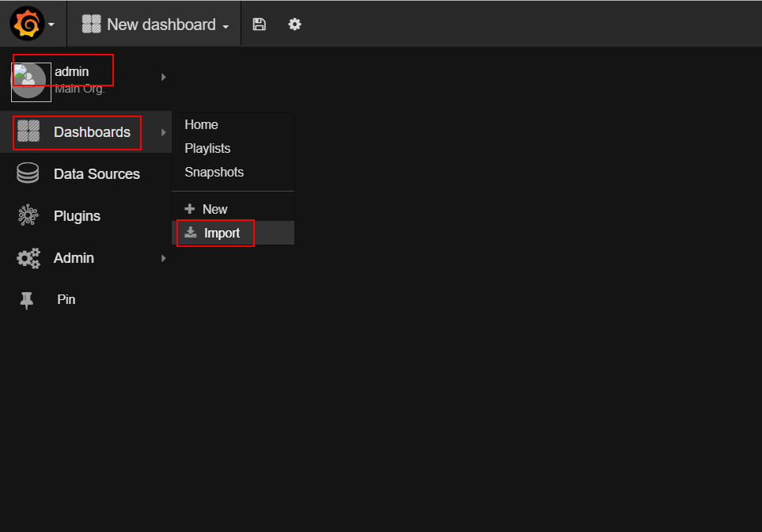
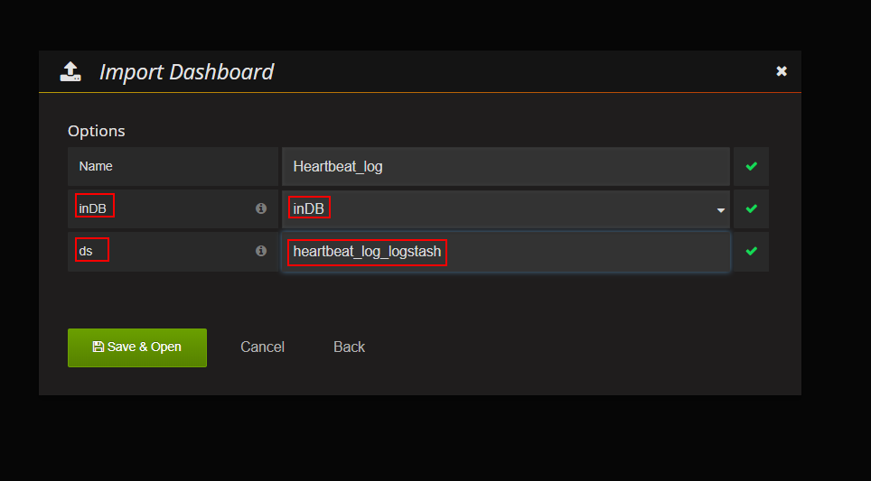

* This will become a table of contents (this text will be scraped).
 {:toc}
**系统架构：**


**总体说明：**

​	DBus可以接入三种数据源：logstash、flume、filebeat，下面以使用logstash为数据抽取端，抽取DBus自身产生的监控和报警日志数据为例进行说明。

​	DBus监控和报警模块部署在 dbus-n2和dbus-n3 上，路径为：/app/dbus/heartbeat/dbus-heartbeat-0.5.0/logs/heartbeat/heartbeat.log。因此，logstash的日志数据抽取端也要部署在dbus-n2和dbus-n3 上。

|  No  |   域名    | 是否有监控和报警日志？ | 是否部署logstash？ | 是否部署心跳shell脚本？ |        抽取日志        |       输出topic        |
| :--: | :-----: | :---------: | :-----------: | :------------: | :----------------: | :------------------: |
|  1   | dbus-n1 |      否      |       否       |       否        |         无          |          无           |
|  2   | dbus-n2 |      是      |       是       |       否        | 1.DBus自身产生的监控和报警日志 | monitor_log_logstash |
|  3   | dbus-n3 |      是      |       是       |       否        | 1.DBus自身产生的监控和报警日志 | monitor_log_logstash |

**主要配置步骤：**

1 配置和安装logstash源相关

2 一键加线和配置

3 检验结果

## 1  配置和安装logstash源相关

监控和报警日志在dbus-n2和dbus-n3上，因此 logstash的日志数据抽取端也要部署在dbus-n2和dbus-n3 上。

### 1.1 logstash安装

* **logstash版本**
  DBus使用的logstash的版本是v5.6.1。

* **dbus-logstash下载**

   包名称：dbus-logstash.tar.gz

   网盘地址： https://pan.baidu.com/s/1b1aKueXLvO2GigB5fa4kNw

  **dbus-logstash目录说明**

  **目录结构：**

  	下载之后，直接在任意目录解压即可，解压目录如下图所示。dbus-logstash包含检测脚本、自动配置脚本、心跳脚本以及启停脚本。


```
   	logstash目录 :logstash程序文件夹。
   	checkDeploy.sh : 内部含有检测kafka连通性及自动更换logstash配置的功能。
   	start.sh :  启动脚本，一键启动logstash程序。
  	stop.sh :   停止脚本，一键停止logstash程序。
```

执行下面命令，自动替换配置项logstash配置项，并检测相关资源连通性：

```
./checkDeploy.sh
```

注：用户也可手动更改logstash配置文件，完成logstash配置。


### 1.2. dbus-logstash启动

1. 修改通用配置：
   修改conf目录下的log-conf.properties文件，对于logstash，只需要修改kafka地址、日志类型及logstash相关配置即可。

   

2. 自动检测部署：

   ```
   执行命令：./checkDeploy.sh
   ```

   执行checkDeploy.sh脚本，可以自动检测kafka是否正常连接，若kafka连接正常，部署脚本将会把conf目录下的修改项替换到logstash配置文件中，用户可以查看reports目录下的检测和部署报告，确认通过后，再进行后续的步骤。

   

3. 启动方式：

   ```
   执行命令：./start.sh
   ```
   启动脚本，该脚本会启动logstash程序。如果没有报错，则会提示logstash启动成功。如果有错误，会提示相应错误信息，请根据错误信息进行修改。

4. 停止方式：

   ```
   执行命令：./stop.sh
   ```

   停止脚本，停止logstash程序。


### 1.3. logstash验证

**读取kafka的topic: monitor_log_logstash，确认是否有数据：**

*  **进入kafka安装目录。**
*  **执行以下命令，查看数据，如果有数据，则说明logstash可以成功抽取文件：**


	bin/kafka-console-consumer.sh --zookeeper dbus-n1:2181,dbus-n2:2181,dbus-n3:2181/kafka  --topic monitor_log_logstash
* **logstash的心跳数据样例：**

  ```json
  {
  	"host": "dbus-n2",
  	"@version": "1",
  	"clock": 1534490912,
  	"@timestamp": "2018-08-17T07:28:32.412Z",
  	"type": "dbus-heartbeat"
  }
  ```

* **logstash抽取之后产生的数据样例：**

  ```json
  {
      "path": "/app/dbus/dbus-heartbeat-0.5.0/logs/heartbeat/heartbeat.log",
      "@timestamp": "2018-08-17T07:28:32.412Z",
      "level": "WARN",
      "log": "CheckHeartBeatEvent 196 - 节点:/DBus/HeartBeat/Monitor/test/dbus/db_heartbeat_monitor/0,状态:异常,报警次数:1,超时次数:1",
      "@version": "1",
      "host": "dbus-n3",
      "thread": "check-heartbeat-event",
      "message": "[check-heartbeat-event] WARN : 2018/08/17 07:28:31.906 CheckHeartBeatEvent 196 - 节点:/DBus/HeartBeat/Monitor/test/dbus/db_heartbeat_monitor/0,状态:异常,报警次数:1,超时次数:1",
      "type": "monitor_log_logstash",
      "timestamp": "2018/08/17 07:28:32.906 "
  }
  ```


## 2 DBus 一键加线和配置

### 2.1 DBus一键加线
   logstash的新加线过程和filebeat的新加线过程是一样的，这里的图片引用了filebeat的加线过程，请知悉。

   logstash将数据抽取到Kafka topic后，DBus程序就可以对该topic数据进行处理了，在DBus web进行数据源和table的配置工作。

   - **新建数据源：**首先新建数据源，进入New DataLine页面，由于我们是用logstash对心跳日志进行抽取，因此数据源的名字可以起的有意义一些，Type选择log_logstash，topic必须和logstash配置文件中的topic一致。

     

   - **新增表：**点击Add Table按钮，新增一张表，稍后会对该表进行规则配置，新增完后，点击下一步。

     

   - **启动log_processor程序：**启动storm程序，对数据进行处理，后面会对新增表进行规则配置。

     

   - **启动结果：**点击启动按钮后，当Status变为running后，表示启动成功，如果启动不成功，可以通过log定位失败原因。
       

### 2.2 数据源配置修改

   	因为我们在dbus-n1和dbus-n2两台机器中分别配置了logstash程序，用于对数据进行抽取，而DBus监控和报警模块会对来自这两台机器的数据流进行监控，因此，我们需要在数据源配置信息中，将多台主机的host信息填入dsPartition选项中，供dbus监控和报警模块使用，注意：如果主机的hostname是ip，请将"."转换为"_"，例如：127.0.0.1应该要转换为127_0_0_1。

   - 修改数据源信息，点击“修改”按钮进行修改。
     
   - **填写host信息：**该数据源的数据可能来自于多个主机上的logstash程序，要在dsPartition中，配置上所有主机的host信息，为DBus监控和报警模块使用。
     

### 2.3. 配置规则

   - 进入Data Table页面，查看新增加的表，点击Rules按钮，为该表配置规则。

     

   - **新增规则组：**点击Add group按钮，新增一个规则组，点击规则组名字，进入规则配置页面。

     

   - **配置规则:**  topic是在logstash中配置的topic，即源topic，可以指定offset，获取固定区间的数据，然后点击show data按钮，此时会在页面下方显示原始数据，点击Add，新增一些过滤规则，对数据进行处理。配置完规则后，查看过滤出的数据，点击“保存所有规则”按钮，保存规则，并返回到规则组页面。

     添加规则具体步骤和方法，请参考：[日志规则配置](config-rule.html)

     

   - **升级版本：**首先使规则组的Status状态变为active，然后点击升级版本（每次增加、删除或修改规则组后，都应该对该表升一次版本）。

     

   - **拉取增量：**使该表的状态变为ok，点击active生效按钮，使该表生效（当后续再对该表进行规则组配置操作后，也应该对该表再执行active生效按钮，使该表能够获取到最新的规则配置）。

     

##  3  验证数据

我们可以在grafana配置以下，看看实际流量情况。

* 上传grafana配置文件：[参考链接](https://github.com/BriData/DBus/tree/master/init-scripts/init-log-grafana-config/)。
   
* **选择InDB数据库：**ds的名字必须与新建数据线中的数据源名字一致。
   


* **之前新增表的流量监控信息，type表示来自于哪台主机的数据**
   
* **\_unknown_table_表示不满足任何表的数据**
   

