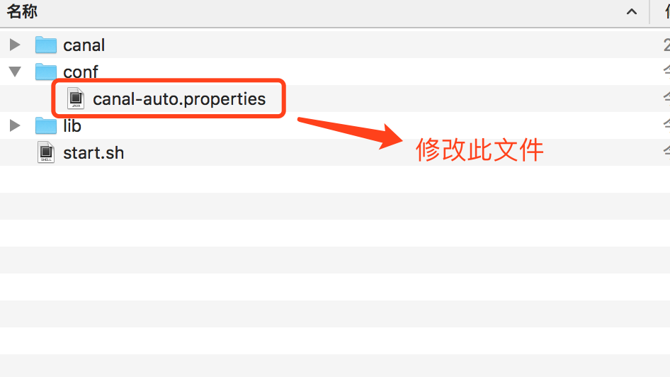
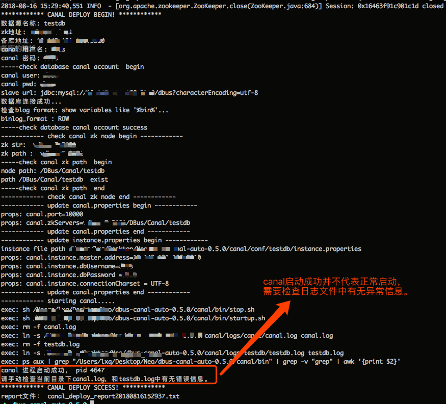
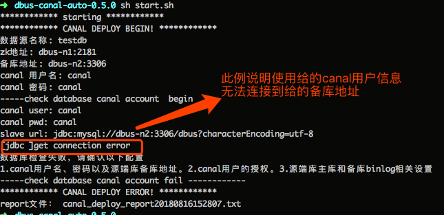
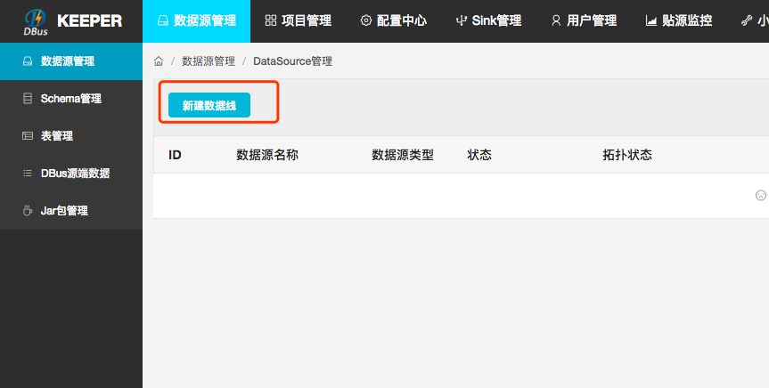
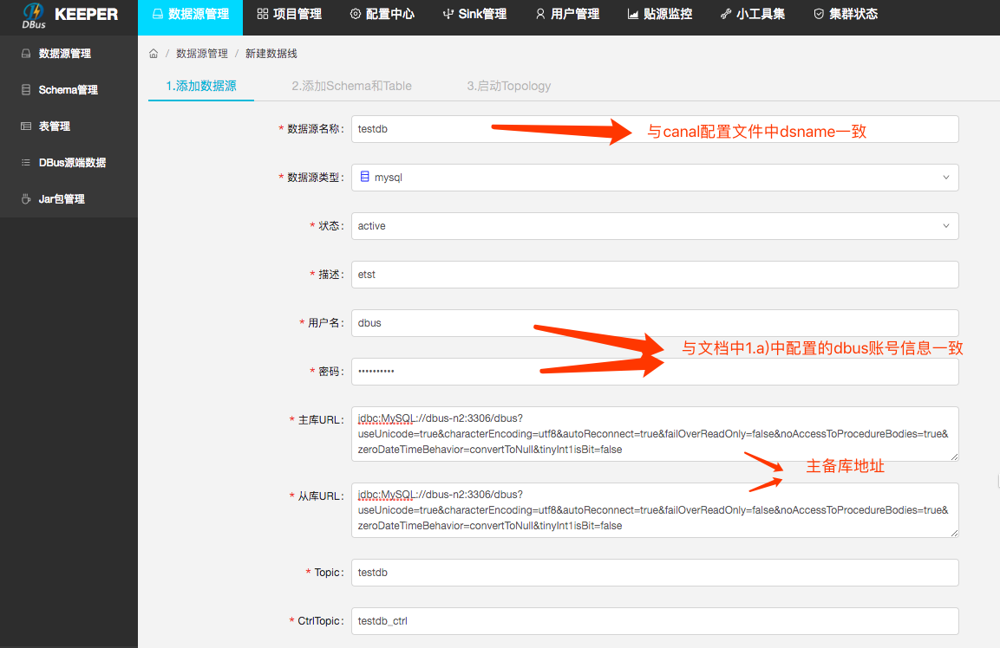
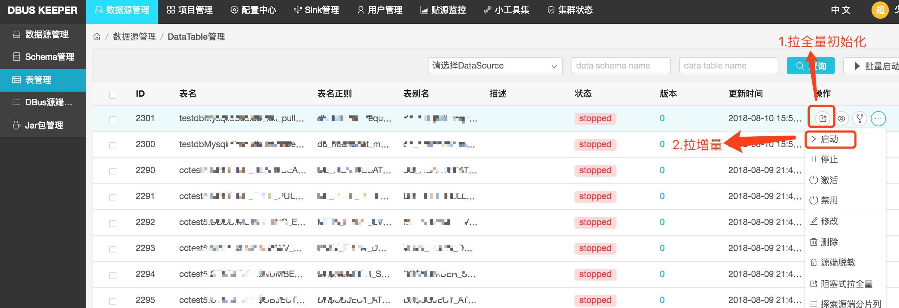

> 原理：
>
> 同步mysql数据源是通过 canal 抽取程序读取binlog的方式获得增量数据， 通过从mysql 备库以分片的方式scan数据来获得全量数据，最后转换为UMS 输出到kafka 提供给下游数据使用方使用。
>
> 环境说明：
>
> - 环境中有dbus-n1，dbus-n2，dbus-n3三个节点，canal安装在了dbus-n1，dbus-n2中
> - mysql数据源的主备分别是dbmysql-master和dbmysql-slave两个节点
> - mysql_instance实例安装在上述两个节点dbmysql-master和dbmysql-slave上


下面从 mysql_instance实例中的test 库的 actor和actor2 表为例，介绍如何配置mysql数据源。

配置中用到的基础环境的情况请参考[基础组件安装](install-base-components.html) 


**相关依赖部件说明：**

-  Canal  ：版本 v1.0.22   DBus用于实时抽取binlog日志。DBus修改一个1文件, 具体配置可参考canal相关支持说明，支持mysql5.6，5.7 
-  Mysql ：版本 v5.6，v5.7  存储DBus管理相关信息                             

**限制：**

- 被同步的Mysql blog需要是row模式
- 考虑到kafka的message大小不宜太大，目前设置的是最大10MB，因此不支持同步mysql     MEDIUUMTEXT/MediumBlob和LongTEXT/LongBlob,     即如果表中有这样类型的数据会直接被替换为空。


**配置总共分为3个步骤：**

1. **数据库源端配置**
2. **canal部署**
3. **加线和查看结果**

   ​

## 1 数据库源端配置

> 数据库源端配置只在第一次配置环境时需要，在以后的加表流程中不需要再配置。
>

此步骤中需要在mysql数据源的mysql_instance实例上创建一个名字为dbus的库，并在此库下创建表db_heartbeat_monitor和db_full_pull_requests两张表，用于心跳检测和全量拉取。

在数据源端新建的dbus库，可以实现无侵入方式接入多种数据源，业务系统无需任何修改，以无侵入性读取数据库系统的日志获得增量数据实时变化。


### 源端库和账户配置

在mysql_instance实例上，创建dbus 库以及数据表db_full_pull_requests和db_heartbeat_monitor；创建dbus用户，并为其赋予相应权限。

**a) 创建dbus库和dbus用户及相应权限**

```mysql
	--- 1 创建库，库大小由dba制定(可以很小，就2张表）
	create database dbus;

	--- 2  创建用户，密码由dba制定
	CREATE USER dbus IDENTIFIED BY 'your_password';

	--- 3 授权dbus用户访问dbus自己的库
	GRANT ALL ON dbus.* TO dbus@'%'  IDENTIFIED BY 'your_password';

	flush privileges; 
```

**b) 创建dbus库中需要包含的2张表，创建细节如下：**

```mysql
	-- ----------------------------
	-- Table structure for db_full_pull_requests
	-- ----------------------------
	DROP TABLE IF EXISTS `db_full_pull_requests`;
	CREATE TABLE `db_full_pull_requests` (
	  `seqno` bigint(19) NOT NULL AUTO_INCREMENT,
	  `schema_name` varchar(64) DEFAULT NULL,
	  `table_name` varchar(64) NOT NULL,
	  `physical_tables` varchar(10240) DEFAULT NULL,
	  `scn_no` int(11) DEFAULT NULL,
	  `split_col` varchar(50) DEFAULT NULL,
	  `split_bounding_query` varchar(512) DEFAULT NULL,
	  `pull_target_cols` varchar(512) DEFAULT NULL,
	  `pull_req_create_time` timestamp(6) NOT NULL,
	  `pull_start_time` timestamp(6) NULL DEFAULT NULL,
	  `pull_end_time` timestamp(6) NULL DEFAULT NULL,
	  `pull_status` varchar(16) DEFAULT NULL,
	  `pull_remark` varchar(1024) DEFAULT NULL,
	  PRIMARY KEY (`seqno`)
	) ENGINE=InnoDB AUTO_INCREMENT=1 DEFAULT CHARSET=utf8;
	SET FOREIGN_KEY_CHECKS=0;
	
	-- ----------------------------
	-- Table structure for db_heartbeat_monitor
	-- ----------------------------
	DROP TABLE IF EXISTS `db_heartbeat_monitor`;
	CREATE TABLE `db_heartbeat_monitor` (
	  `ID` bigint(19) NOT NULL AUTO_INCREMENT COMMENT '心跳表主键',
	  `DS_NAME` varchar(64) NOT NULL COMMENT '数据源名称',
	  `SCHEMA_NAME` varchar(64) NOT NULL COMMENT '用户名',
	  `TABLE_NAME` varchar(64) NOT NULL COMMENT '表名',
	  `PACKET` varchar(256) NOT NULL COMMENT '数据包',
	  `CREATE_TIME` datetime NOT NULL COMMENT '创建时间',
	  `UPDATE_TIME` datetime NOT NULL COMMENT '修改时间',
	  PRIMARY KEY (`ID`)
	) ENGINE=InnoDB DEFAULT CHARSET=utf8;
	
	SET FOREIGN_KEY_CHECKS=0;
```

**c)  dbus用户拉备库权限**

   获取拟拉取的目标表备库的读权限，用于初始化加载，schemaName1.tableName1是需要同步的表名：


```mysql
  -- GRANT select on schemaName1.tableName1 TO dbus;
  GRANT select on test.t1 TO dbus;
  GRANT select on test.t2 TO dbus;
  
  flush privileges; 
```
如上dbus库配置命令，详见https://github.com/BriData/DBus/tree/master/initScript下mysql insatall文件夹。

**d) 在mysql数据源的mysql_instance实例中创建Canal用户，并授予相应权限：**

```mysql
  --- 创建Canal用户，密码由dba指定, 此处为canal
  CREATE USER canal IDENTIFIED BY 'canal';    
  --- 授权给Canal用户
  GRANT SELECT, REPLICATION SLAVE, REPLICATION CLIENT ON *.* TO 'canal'@'%';

  FLUSH PRIVILEGES; 
```

## 2 canal配置

**1) 下载canal自动部署包：**


下载dbus-canal-auto-0.5.0.tar.gz，该包是一体化解决方案，包含cannal，不用单独下载canal。
将包放到要部署canal的目录下，解压后得到目录如下：



**目录：**

- canal目录是自带的canal，该文件夹不能重命名，否则脚本会运行失败。
- conf 目录下的canal-auto.properties是需要用户配置的
- lib 目录不用关心
- start.sh 自动化脚本


**2) 脚本使用：canal自动部署和检查：**


首先，将conf目录下的canal-auto.properties文件中内容，修改成自己的信息。例如：

  ```properties
#要添加的数据源名称
dsname=testdb
#zk地址,如果是集群环境，使用逗号隔开
zk.path=127.0.0.1:2181,127.0.0.2:2181,127.0.0.3:2181
#源端库备库地址
slave.path=jdbc:mysql://localhost:3306/test?characterEncoding=utf-8
#改成设置的canal用户名
canal.user=canal
#改成设置的canal用户密码
canal.pwd=canal
  ```
  
  **a.canal自动部署：**
  


替换完毕后，执行sh start.sh。 它会自动检查你填写的canal-auto.properties文件中内容。包括canal账户可用性，zk的连通性等。如果检查通过，会自动启动canal。
如果启动成功，会打印出“canal pid start success ,pid is 70548”字样，如图：


同时会生成“canal_deploy _report”打头的日志文件，查看日志文件可看到执行的信息和结果。成功如下：

  ```properties
************ CANAL DEPLOY BEGIN! ************
数据源名称: testdb
zk地址: 127.0.0.1:2181,127.0.0.2:2181,127.0.0.3:2181
备库地址: jdbc:mysql://localhost:3306/test?characterEncoding=utf-8
canal 用户名: canal
canal 密码: canal
-----check database canal account  begin 
canal user: canal
canal pwd: canal
slave url: jdbc:mysql://localhost:3306/test?characterEncoding=utf-8
-----check database canal account success
------------ check canal zk node begin ------------ 
zk str:  127.0.0.1:2181,127.0.0.2:2181,127.0.0.3:2181
zk path :  127.0.0.1:2181
-----check canal zk path  begin 
node path: /DBus/Canal/testdb
path /DBus/Canal/testdb exist
-----check canal zk path  end 
------------ check canal zk node end ------------ 
------------ update canal.properties begin ------------ 
props: canal.port=10000
props: canal.zkServers=127.0.0.1:2181,127.0.0.2:2181,127.0.0.3:2181/DBus/Canal/testdb
------------ update canal.properties end ------------ 
------------ update instance.properties begin ------------ 
instance file path /Users/lxq/Desktop/Neo/dbus-canal-auto-0.5.0/canal/conf/testdb/instance.properties
props: canal.instance.master.address=jdbc:mysql://smp-mysql-master-test.caiwu.corp:3412/dbus?characterEncoding=utf-8
props: canal.instance.dbUsername=canal
props: canal.instance.dbPassword =canal
props: canal.instance.connectionCharset = UTF-8
------------ update canal.properties end ------------ 
------------ starting canal.....
exec: sh /app/dbus-canal-auto-0.5.0/canal/bin/stop.sh
exec: sh /app/dbus-canal-auto-0.5.0/canal/bin/startup.sh
exec: rm -f canal.log
exec: ln -s /app/dbus-canal-auto-0.5.0/canal/logs/canal/canal.log canal.log
exec: rm -f testdb.log
exec: ln -s /app/dbus-canal-auto-0.5.0/canal/logs/testdb/testdb.log testdb.log
************ CANAL DEPLOY SCCESS! ************
  ```

如果执行失败，程序运行不会打印出canal的pid，例如：

然后检查部署report报告文件，此处将zk地址写错，日志会打印zk连接失败，最后部署失败，如：

  ```properties
************ CANAL DEPLOY BEGIN! ************
数据源名称: testdb
zk地址: jdbc:mysql://localhost:3306/test?
备库地址: jdbc:mysql://localhost:3306/test?characterEncoding=utf-8
canal 用户名: canal
canal 密码: canal
-----check database canal account  begin 
canal user: canal
canal pwd: canal
slave url: jdbc:mysql://localhost:3306/test?characterEncoding=utf-8
-----check database canal account success
------------ check canal zk node begin ------------ 
zk str:  jdbc:mysql://localhost:3306/test?
zk connect fail... 
------------ check canal zk node fail ------------ 
************ CANAL DEPLOY ERROR! ************
  
  ```
 如果程序执行成功，会在当前目录创建canal.log和 testdb.log的link,即可以查看canal的日志。
 

  **b.自动check：**
  
  直接执行脚本执行sh start.sh，会执行配置的检测、自动替换和启动着几个动作。该脚本同时还提供单独的检测功能。执行sh start.sh check.即加上check参数，输出结果与自动部署类似。根据程序输出的pid会检测canal的启动情况，输出pid情况，表示当前canal程序在执行。

自动检测也会生产报告，“canal _check _report”打头的检测日志。同部署类似，会有打印出类似检测结果：

  ```properties
  
************ CANAL CHECK BEGIN! ************
-----check database canal account  begin
canal user: dbus
canal pwd: dbus111
slave url: jdbc:mysql://locakhsot:3306/dbus?characterEncoding=utf-8
[jdbc ]get connection error
-----check database canal account fail ------------
************ CANAL CHECK FAIL! ************
  
  ```

###### ##为什么检测通过还是失败？
脚本提供的是常规性检测。包括：canal账户连接数据库、zk连通性、zk上canal节点，检测报告是为了帮助你进行初步的检测，和提供部署的便捷。除了检测报告，您还可以根据自动部署时创建的日子link，查看canal的日志，有时，虽然canal进程启动成功，但是其实是执行失败的，在日志里有错误详情。
###### ##为什么自动部署失败？
脚本提供的是在特定情况下，帮助简化安装部署步骤的。如果自动部署的脚本无法满足您的需求，请参考手动部署文档部分[mysql手动部署](install-mysql-source.html)。
###### ##为什么不支持呢

Dbus系统丢弃掉对大数据类型MEDIUMBLOB、LONGBLOB、LONGTEXT、MEDIUMTEXT等的支持，因为dbus系统假设最大的message大小为10MB，而这些类型的最大大小都超过了10MB大小。对canal源码的LogEventConvert.java进行了修改，而此文件打包在canal.parse-1.0.22.jar包中，因此在canal server包解压之后，需要按照替换解压后的canal目录中lib下的canal.parse-1.0.22.jar文件。

可用https://github.com/BriData/DBus/blob/master/third-party-packages/canal/canal.parse-1.0.22.jar替换上述原始jar包。

## 3 Dbus一键加线

Dbus对每个DataSource数据源配置一条数据线，当要添加新的datasource时，需要新添加一条数据线。下面对通过dbus keeper页面添加新数据线的步骤进行介绍
### 3.1 Keeper加线

##### 3.1.1 管理员身份进入dbus keeper页面，数据源管理-新建数据线




##### 3.1.2 填写数据源基本信息 （master和slave jdbc连接串信息）

其中mysql-master是mysql数据源主库，Dbus中用于接受心跳检测数据，以便监测数据表数据是否正常流转。mysql-slave是mysql数据源备库，用于全量拉取数据，以便降低对主库正常业务数据查询影响。 




##### 3.1.3 下拉选择要添加的schema，勾选要添加的表。Keeper支持一次添加多个schema下的多个table；


##### 3.1.4 启动Topology

在点击启动操作按钮之前请确保，storm服务器上面的/app/dbus/apache-storm-1.0.2/dbus_jars目录下，已经上传了最新的jar包。

然后分别点击dispatcher-appender、splitter-puller、extractor的启动按钮，系统则根据path路径自动执行相应 topology的shell脚本，启动成功后Status状态变为running。


新线部署完成

**2.6 拉取增量和全量数据**

新添加的数据线，其schema中的table处于stopped状态。需要到dbus keeper中对相应的表，先拉取增量数据，才能让其变成OK状态。处于OK状态的表才会正常的从mysql数据源同步数据到相应的kafka中。拉取完成增量之后，可以根据业务需要确定是否需要拉取全量数据。




##### 2.7 如果新加线过程中出现问题

如果新加线过程中出现问题时，可以先删除已经添加到一半的新线Datasource，然后再重新添加新线。

​	


### 3.2 验证增量数据

#### a) 插入数据

​	向数据源的数据表中添加数据，检验效果。此处以testdb数据源的test数据库的表actor中添加数据为例，向此表插入几条数据之后，会看到kafka UI中相应的topic:  testdb, testdb.test, testdb.test.result的offset均有所增加。也可以在grafana中查看数据流的情况。

​	如果数据源中添加的schema和数据表已经存在数据，点击dbus web中的拉增量和拉全量，将现有数据同步到kafka中。

#### b) grafana看增量流量

​	上述向数据表中添加完数据后，过大约几分钟，会在grafana中显示数据的处理情况。如下图中，两组则线图分别表示：计数和延时，正常情况下计数图中"分发计数器"和"增量计数器"两条线是重合的。在图左上角，选择要查看的数据表，此处为testdb.test.actor。上部的分发器计数图展示了此表的分发和增量程序接收到7条数据；下部的分发器延时展示分发延时、增量延时和末端延时情况。


### 3.3 验证全量拉取

验证全量拉取是否成功，可到Dbus web的zk manager下查看全量拉取状态。如下图中，选取zookeeper Manager中的/DBus/FullPuller下相应数据源、数据库与数据表中相应拉全量版本，查看结点信息。看结点信息中Status状态，其中splitting表示正在分片，pulling表示正在拉取，ending表示拉取成功。