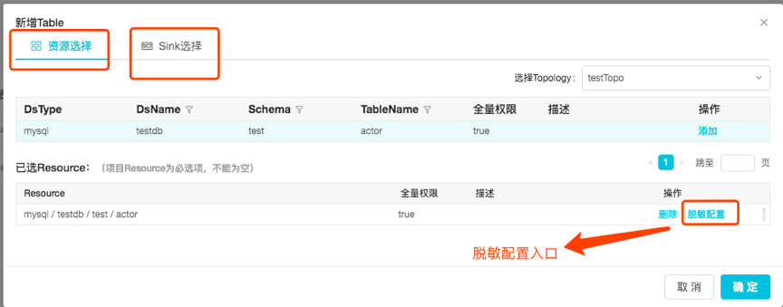

> 说明：
>
> 针对有多租户需求的用户，没有的话可略过。
>
> 租户的界面没有了管理员导航上的功能，只对自己的项目有可读和操作权限
>

**租户界面总览如下：**


下面重点介绍拓扑管理和项目表管理


   ​

## 1. Topology 管理

> topology属于项目，用户可以添加、删除和操作自己的拓扑，用以承载表的信息。表的信息需要依赖于topology，topology在start成功，变为running状态后，表的”启动”才能生效
>

**Topology状态简介：**

- new :刚新建
- stopped : running状态停止操作后
- running : new/stopped启动后
- changed : running状态修改后


**Topology操作简介：**


**操作说明：**

- 新增 ： jar包和jar包版本的选择，依赖admin通过“jar包管理“操作添加的内容。
- 拖回重跑 ： 如果租户觉得自己的数据有问题，想重新消费kafka的数据，该功能可以提供该能力。该功能只有running状态的topology能使用。

###### ##如果拖回重跑，有什么影响？
```
  --- 正产品：能从指定offset重新消费数据，这是我们想要的;    
  --- 副产品： 该topo上跑的表都会受影响
  
```


## 2. 项目表管理  

>表是项目级下的定义，同时需要依赖topology，即：某个项目的某个topology下的某个表，才是唯一的
>
>

**表操作简介：**


###2.1 新增表


表添加的时候分为两个步骤

**2.1.1 资源选择：分配拓扑和资源，然后配置表的脱敏信息。**

>配置脱敏信息是两个操作的集合：
>
>1）	选择输出列，分为：
>
>---a)	固定列，自定义选择输出并配置脱敏信息
>
>---b)	输出所有列，表示输出的结果列将与源端的输出列始终保持一致，如果源端发生了表结构变更（包括输出列的数量以及列的类型和脱敏等）信息，输出列也会随之改变。
>
>2）	脱敏配置：在选择的输出列上添加脱敏信息。带有源端脱敏和项目级脱敏信息的列，租户只能增加和删除；其他列，用户选择可添加自定义的脱敏或不脱敏。


**2.1.2 sink选择：**


###2.2 操作列功能介绍


>项目表的状态分为三种
> 
> --1.stopped 默认值
>
> --2. running “启动“操作后，表的增量数据在topology上流动。
>
>--3. changed 该状态是指表在running的时候，租户使用了“修改“操作。
>

**操作简介：**

- 启动/停止：table增量数据的启停，状态切换为running/stopped
- 修改： 修改表的信息，修改后只是更新数据库的信息。running的表状>态会变成changed。stopped表修改后就生效。
- 生效：changed状态的表，点生效，增量数据会使用修改后的表信息。
- 拉全量/查看拉全量历史：租户发起拉全量。注：只有管理员赋予了拉全量权限，才可以能看到拉全量及查看拉全量历史查看按钮。超链到管理员手册对应说明

