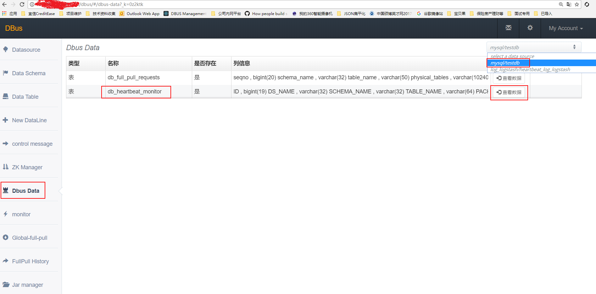
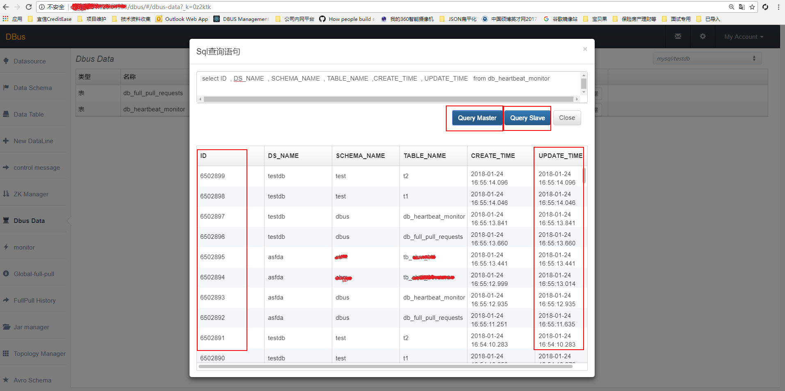

​	DBus提供了完整的监控机制，监控从源端到目标端整条链路的健康状况。当其中某一个环节出现问题，比如：停服、超时等，会自动报警。有时报警是因为DBus本身的某个/某些环节出问题，有时候，则是因为源端数据源有问题引起。其中源端数据源出问题引起报警的情况，以主备不同步/主备同步时间过长居多。这种情况，非DBus能处理，需通知DBA介入。

​	当发生超时报警时，为了确定是否是源端主备不同步引起，DBus Web提供了检查源端数据库主备同步状况的功能。

​	具体如下：

1 登录DBus web管理系统，进入Dbus Data页面，点击右上角的下拉列表，选择你想探查的数据源，页面会出现该数据源源端DBus库一些表的信息，如下图： 

2 点击DB_HEARTBEAT_MONITOR表对应的“查看数据”按钮，会弹出数据源主备库数据查询界面：

3 分别点击Query Master和Query Slave按钮，对比查到的数据，同一条数据的UPDATE_TIME是否相差过大。若相差过大，则表明源端数据库主备不同步。超时报警时源端数据库主备不同步引起。