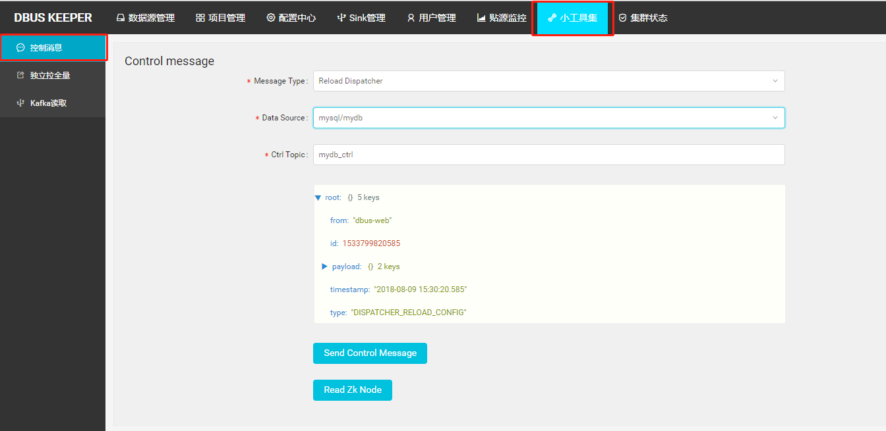

 {:toc}

***

## <a name="faq_grafana_err" id="faq_grafana_err">Q1:为什么grafana不显示统计数据？</a>
dbus是一个包含多个模块流式计算系统，实时数据需要经过的链路为：`canal`→`extractor`→`dispatcher`→`appender`，任何一个环节出现问题都可能导致grafana中无法显示统计数据，针对以下三种场景给出问题的可能的原因以及解决办法；
* 添加schema或table

    可能原因：缓存没有成功刷新或者配置没有被重新加载，添加schema或者table时系统已经处于运行状态中，各个模块都有自己的本地缓存，新添加的table保存在数据库或者zookeeper中，正常情况下dbus web管理功能中添加schema或table后会自动发送控制消息通知相关模块重新加载配置、刷新缓存，如果由于某种原因导致发送控制消息失败或者相关模块处理控制消息失败则可能出现grafana中看不到统计数据折线图的情况

    解决办法：手动调用相关模块的重新加载功能，需要重新加载的模块有`extractor`、`dispatcher`和`appender`，重新加载模块功能请参考：[如何重新加载模块](#faq_control_message)

* 新建数据线
    可能原因一：新建数据线后并没有自动reload `heartbeat`模块

    解决办法：手动reload `hreatbeat`模块，请参考：[如何重新加载模块](#faq_control_message)


    可能原因二：请确认是否配置了canal抽取端
    解决办法：参考canal抽取端配置
* 拉全量导致的问题

    可能原因：拉全量时会暂时停止`appender`模块的数据流，在无论全量拉取成功或失败都会发送控制消息给`appender`模块，`appender`模块接收到控制消息后会唤醒数据接收线程(spout)继续处理数据，但如果全量模块因为某种原因没有发送控制消息给`appender`模块，则数据流会一直处于暂停状态，grafana监控中便无法显示`增量计数`，这样’增量计数’和`分发器计数`两条折线将会不同步。

    解决办法：登录dbus web进入到`Data table`菜单，在查询条件中选择datasource，在schemaName输入框中输入相应的schema name点击Search并在列表中找到停止处理数据的表（状态为非`ok`状态），点击`IncrementPuller`按钮即可恢复数据流.


## <a name="faq_monitor_err">Q2:为什么monitor页面无法显示？</a>
此页面的地址需在web配置页面进行配置，Global-Config的Monitor内容为此页面的地址。将统计数据的grafana页面的url填入Monitor保存即可。

## <a name="faq_control_message">Q3:如何重新加载模块？</a>

模块重新加载功能通过发送 `control message` 实现，请登录dbus web管理系统进入 `control message` 页面，如下图所示，其中 `message type` 定义了要加载的模块，`data source` 定义了要加载的数据源，`ctrl_topic` 表示消息写入的kafka topic，此项不需要修改，下方为消息预览和 `Send Control Message` 按钮，点击这个按钮即可完成控制消息的发送从而完成模块重新加载.




## <a name="faq_deployment_err">Q4:一键上线为何失败？</a>

一键上线的作用是配置抽取新数据库数据的完整流程，因此影响一键上线的因素非常多，下面针对一键上线中步骤中需要注意的问题：

* 数据源基本信息需要填写user和password， 这里user指的是**和待抽取的数据库在同一个Mysql实例的dbus用户的用户名和密码**，dbus用户一键上线之前操作之前需要被赋予待抽取数据库表的 `select` 权限，可以参考FAQ：[Q6:如何授权dbus用户读取源端表](#faq_auth_tab2dbus)

* 选择schema这一步可以参考[add schema and table流程]( https://github.com/BriData/DBus/wiki/Usage(5)-add-schema-and-table)

* 修改zk配置步骤中 ` Clone ZkConf From Templates` 的作用是将zookeeper 中的节点 `/DBus/ConfTemplates` 下的所有节点复制一份并做一些适当的修改以作为新创建的数据源的配置信息。这里能够成功的前提是在前期的准备过程中已经对`/DBus/ConfTemplates` 节点进行过初始化，初始化过程请参考：[Usage(2) Start and Check](https://github.com/BriData/DBus/wiki/Usage(2)-Start-and-Check#4-storm)

* 启动Topology步骤的作用是运行三个storm topology，启动storm topology之前需要首先将topology jar和启动脚本包上传的storm nimbus所在服务器的指定目录，同时在 `global config` 中配置启动脚本所在的目录，参考：[Usage(3) web basic configuration]( https://github.com/BriData/DBus/wiki/Usage(3)-web-basic-configuration)的全局配置部分，由于dbus web服务器和storm nimbus服务器通常不是同一台服务器，因此需要配置两台机器之间的ssh免密登录。

## <a name="faq_view_monitor_alarm">Q5:如何看监控和报警？</a>

**邮件**

内容形式为：

    Address: abc@126.com
    Subject: DBus心跳监控报警
    Contents: 尊敬的先生/女士您好，Dbus心跳监控发现数据线路:/DBus/HeartBeat/Monitor/db/schema/table发生异常，报警次数:1,超时次数:1,请及时处理.

**DBus-Web**

* 检查表状态是否ok

* 查看版本变更历史

* 查看Grafana

**心跳日志**

在心跳log中，搜索关键字：`Address`或`Subject`或`Contents`，即可找到报警记录

## <a name="faq_auth_tab2dbus" id="faq_auth_tab2dbus">Q6:如何授权dbus用户读取源端表?</a>

dbus web会通过`data source` 中的 `slave_url` 和 `dbus` 用户与源库建立jdbc连接，以便于通过dbus web配置以及使用dbus系统进行初始化数据拉取，因此为了能够读取到源库表的信息，需要给`dbus`用户赋带抽取表的查询权限，具体授权语句如下：
```sql
-- db.table 是需要同步的表名
grant select on db1.table to dbus;
```

